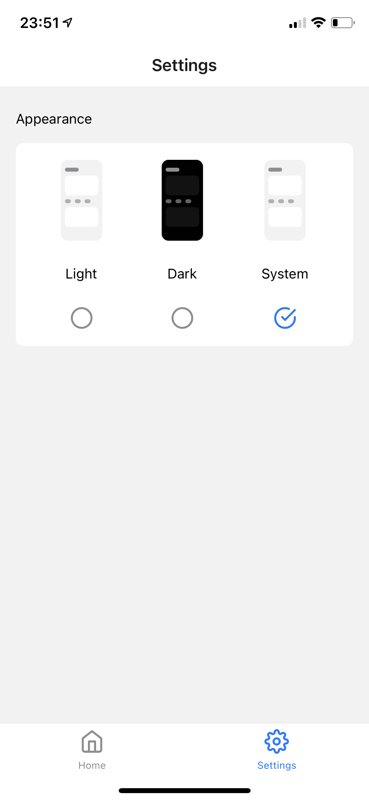

# dark-mode-demo

| Light / System               | Dark                        |
| ---------------------------- | --------------------------- |
|  |  |

## AppearanceSettingsProvider

```js
function AppearanceSettingsProvider({children}: Props) {
  const [appearance, setAppearance] = useState('system')

  const value = useMemo(() => {
    return {appearance, setAppearance} as AppearanceContext
  }, [appearance])

  useEffect(() => {
    async function getSettingsFromLocalStorage() {
      try {
        const value = await Storage.getItem('appearanceSettings')
        setAppearance(value || 'system')
      } catch (e) {
        setAppearance('system')
      }
    }
    getSettingsFromLocalStorage()
  }, [])

  useEffect(() => {
    Storage.setItem('appearanceSettings', appearance)
  }, [appearance])

  return (
    <AppearanceSettings.Provider value={value}>
      {children}
    </AppearanceSettings.Provider>
  )
}
```

## useTheme

```js
const dark = {
  colors: DARK_THEME,
  ...
}

const light = {
  colors: LIGHT_THEME,
  ...
}

function useTheme() {
  let theme = useColorScheme()
  const {appearance} = useAppearanceSettings()

  if (appearance !== 'system') {
    theme = appearance
  }

  return theme === 'dark' ? dark : light
}

// usage
function Text({children, style, ...props}: Props) {
  const {colors} = useTheme()
  return (
    <RNText style={[{color: colors.label}, style]} {...props}>
      {children}
    </RNText>
  )
}
```
